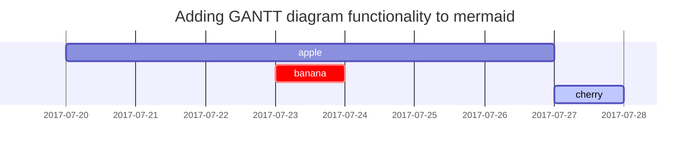

# Origin Story
I like the idea of tattoo. I don't have one myself because 
1. Its expensive
2. I don't know something I love enough to permanently be attached to me
3. Its expensive.

I used to get [**face-paints**](https://www.google.com/search?q=face+painting&rlz=1C1GCEA_enID1105ID1105&oq=face+paint&gs_lcrp=EgZjaHJvbWUqDQgAEAAYsQMYyQMYgAQyDQgAEAAYsQMYyQMYgAQyBggBEEUYOTIKCAIQABiSAxiABDIHCAMQABiABDIHCAQQABiABDIHCAUQABiABDIHCAYQABiABDIHCAcQABiABDIHCAgQABiABDIHCAkQABiABNIBCDExOThqMGo3qAIAsAIA&sourceid=chrome&ie=UTF-8#vhid=DQuqqR7HRT_9WM&vssid=l). Loved butterfly facepaints but it was too feminine but that's a topic for another day.

So when I learned about semi-permanent tattoos I was excited because
1. Its cheap
2. It's not gonna be there forever so I don't have to think about it too much
3. Its cheap

# Semi-Permanent is a buzzword
Wiki link to tatoo is awesome https://en.wikipedia.org/wiki/Tattoo
I got my "semi-permanent" tattoo from [**this store**](https://tokopedia.link/16PYPv3BFJb)

# Why semi-permanent takes a while to develop
https://help.inkbox.com/hc/en-us/articles/360034768491-How-long-will-it-take-for-my-tattoo-to-develop
oxidatively activated pigment tattoo
Some papers 
https://enveurope.springeropen.com/articles/10.1186/s12302-015-0044-7
https://www.ncbi.nlm.nih.gov/pmc/articles/PMC9314285/
can't believe tiktok was the most helpful
https://www.tiktok.com/@ezink.co/video/7284353559041215746

## Its unhealthy, kinda
Gardenia-Ink 
Jagua https://www.youtube.com/watch?v=fWRIN_n_NEo
Difficult to search because it keeps shoving you to stores.

The chemical inside the thing tyhat oxisides https://en.wikipedia.org/wiki/Genipin
https://www.sciencedirect.com/topics/agricultural-and-biological-sciences/genipin
https://www.sciencedirect.com/topics/agricultural-and-biological-sciences/photosynthetic-pigment

## Its prone to scummy practices
Additives are added so its not the "healthy" thing that the old tribes used to do  
https://www.mdpi.com/2079-9284/7/4/74


# Its cheap!


# Reading List
https://momentaryink.com/blogs/news/how-do-temporary-tattoos-work#:~:text=Most%20temporary%20tattoos%20contain%20backing,tattoo%20contains%20ink%20and%20adhesive.
https://www.youtube.com/watch?v=BZ69K2GPYIM
Semi Permanent vs Temporary https://www.tatteco.com/blogs/blog/semi-permanent-vs-temporary-tattoos-the-pros-cons
Semi-Permanent is a scam https://www.byrdie.com/semi-permanent-tattoos-that-fade-away-3187121


# H1 - heading
{: .mt-4 .mb-0 }

## H2 - heading
{: data-toc-skip='' .mt-4 .mb-0 }

### H3 - heading
{: data-toc-skip='' .mt-4 .mb-0 }

#### H4 - heading
{: data-toc-skip='' .mt-4 }

## Paragraph

Quisque egestas convallis ipsum, ut sollicitudin risus tincidunt a. Maecenas interdum malesuada egestas. Duis consectetur porta risus, sit amet vulputate urna facilisis ac. Phasellus semper dui non purus ultrices sodales. Aliquam ante lorem, ornare a feugiat ac, finibus nec mauris. Vivamus ut tristique nisi. Sed vel leo vulputate, efficitur risus non, posuere mi. Nullam tincidunt bibendum rutrum. Proin commodo ornare sapien. Vivamus interdum diam sed sapien blandit, sit amet aliquam risus mattis. Nullam arcu turpis, mollis quis laoreet at, placerat id nibh. Suspendisse venenatis eros eros.

## Lists

### Ordered list

1. Firstly
2. Secondly
3. Thirdly

### Unordered list

- Chapter
  + Section
    * Paragraph

### ToDo list

- [ ] Job
  + [x] Step 1
  + [x] Step 2
  + [ ] Step 3

### Description list

Sun
: the star around which the earth orbits

Moon
: the natural satellite of the earth, visible by reflected light from the sun

## Block Quote

> This line shows the _block quote_.

## Prompts

> An example showing the `tip` type prompt.
{: .prompt-tip }

> An example showing the `info` type prompt.
{: .prompt-info }

> An example showing the `warning` type prompt.
{: .prompt-warning }

> An example showing the `danger` type prompt.
{: .prompt-danger }

## Tables

| Company                      | Contact          | Country |
|:-----------------------------|:-----------------|--------:|
| Alfreds Futterkiste          | Maria Anders     | Germany |
| Island Trading               | Helen Bennett    | UK      |
| Magazzini Alimentari Riuniti | Giovanni Rovelli | Italy   |

## Links

<http://127.0.0.1:4000>

## Footnote

Click the hook will locate the footnote[^footnote], and here is another footnote[^fn-nth-2].

## Inline code

This is an example of `Inline Code`.

## Filepath

Here is the `/path/to/the/file.extend`{: .filepath}.

## Code blocks

### Common

```
This is a common code snippet, without syntax highlight and line number.
```

### Specific Language

```bash
if [ $? -ne 0 ]; then
  echo "The command was not successful.";
  #do the needful / exit
fi;
```

### Specific filename

```sass
@import
  "colors/light-typography",
  "colors/dark-typography";
```
{: file='_sass/jekyll-theme-chirpy.scss'}

## Mathematics

The mathematics powered by [**MathJax**](https://www.mathjax.org/):

$$ \sum_{n=1}^\infty 1/n^2 = \frac{\pi^2}{6} $$

When $a \ne 0$, there are two solutions to $ax^2 + bx + c = 0$ and they are

$$ x = {-b \pm \sqrt{b^2-4ac} \over 2a} $$

## Mermaid SVG



## Images

### Default (with caption)

<!-- {: width="972" height="589" } -->
_Full screen width and center alignment_

### Left aligned

<!-- {: width="972" height="589" .w-75 .normal} -->

### Float to left

<!-- {: width="972" height="589" .w-50 .left} -->
Praesent maximus aliquam sapien. Sed vel neque in dolor pulvinar auctor. Maecenas pharetra, sem sit amet interdum posuere, tellus lacus eleifend magna, ac lobortis felis ipsum id sapien. Proin ornare rutrum metus, ac convallis diam volutpat sit amet. Phasellus volutpat, elit sit amet tincidunt mollis, felis mi scelerisque mauris, ut facilisis leo magna accumsan sapien. In rutrum vehicula nisl eget tempor. Nullam maximus ullamcorper libero non maximus. Integer ultricies velit id convallis varius. Praesent eu nisl eu urna finibus ultrices id nec ex. Mauris ac mattis quam. Fusce aliquam est nec sapien bibendum, vitae malesuada ligula condimentum.

### Float to right

<!-- {: width="972" height="589" .w-50 .right} -->
Praesent maximus aliquam sapien. Sed vel neque in dolor pulvinar auctor. Maecenas pharetra, sem sit amet interdum posuere, tellus lacus eleifend magna, ac lobortis felis ipsum id sapien. Proin ornare rutrum metus, ac convallis diam volutpat sit amet. Phasellus volutpat, elit sit amet tincidunt mollis, felis mi scelerisque mauris, ut facilisis leo magna accumsan sapien. In rutrum vehicula nisl eget tempor. Nullam maximus ullamcorper libero non maximus. Integer ultricies velit id convallis varius. Praesent eu nisl eu urna finibus ultrices id nec ex. Mauris ac mattis quam. Fusce aliquam est nec sapien bibendum, vitae malesuada ligula condimentum.

### Dark/Light mode & Shadow

The image below will toggle dark/light mode based on theme preference, notice it has shadows.

<!-- {: .light .w-75 .shadow .rounded-10 w='1212' h='668' } -->
<!-- {: .dark .w-75 .shadow .rounded-10 w='1212' h='668' } -->

## Video



## Reverse Footnote

[^footnote]: The footnote source
[^fn-nth-2]: The 2nd footnote source
